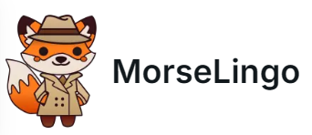

# MorseLingo


MorseLingo is a new way to learn morse code inspired by functionality and style of Duolingo.

Live version:  https://morselingo.com

## Technologies Used

The website is powered by NextJS and Typescript with Tailwind, NextUI and Framer Motion

## How to Use
### Install dependencies

You can use one of them `npm`, `yarn`, `pnpm`, `bun`, Example using `npm`:

```bash
npm install
```

### Run the development server

```bash
npm run dev
```